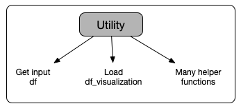
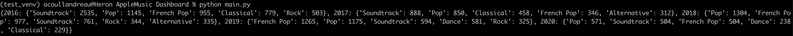

Documentation: apple-music-analyser package
=============================================

In this document, we will go through the ideas and logic of the code of the package. This document is divided into the following sections:

- [Code structure] (#structure)
- [Focus on the VisualizationDataframe module] (#VisualizationDataframe)
- [Focus on the Query module] (#Query)
- [Focus on the Utility module] (#Utility)
- [Focus on the DataVisualization module] (#DataVisualization)
- [Simple example code] (#simple_example)

To understand even better the *why*, please take a look at the exploratory work I did prior to building this project, available as a Jupyter notebook !

Also, don't hesitate to check out the [Medium post](https://medium.com/@mozart38/apple-music-activity-analyser-part-2-3a62c6284eb0) related to how to use the package, as step by step guide.

And finally, for more examples, take a look at the [examples folder](https://github.com/acoullandreau/apple_music_analyser/tree/master/examples)!

<a name="structure">
Code structure
---------------
</a>


The logic of the code is as follow:

### 1. Input
User inputs a zip file (ideally, the archive received from Apple, without modifications). This step is taken care of by the [Utility] (#Utility) module. 

### 2. File parsing
The zip file is read, and a few files are retrieved and parsed. The parsing step consists in cleaning the input files, in order to be able to process them into a simplified and complete dataframe for visualization. Read more about the parsing step below in the [VisualizationDataframe] (#VisualizationDataframe) module focus. 

### 3. Processing and creation of a visualization dataframe
An instance of VisualizationDataframe is created using the parsed input. This instance is in charge of processing the input files, relying on a few other classes, and producing a visualization dataframe.

More details are provided below about the [VisualizationDataframe] (#VisualizationDataframe) module!


### 4. Visualization dataframe and other available objects
A few objects are created with the instance of VisualizationDataFrame, after parsing all files, cleaning and wrangling the data.

These objects are in particular :

- VisualizationDataFrame.df\_visualization

	This dataframe contains a history of the playing activity, with one row per track. For each song, whenever available, we have the genre(s), the rating, whether it is in the library, how it was found (search, library,...), whether it was skipped, the duration of the listening,... This is a complete dataframe that can be used in visualizations to explore and understand the patterns in the listening behaviors. 
		
- VisualizationDataFrame.track\_summary\_objects.genres\_list

	This is the list of all the unique genres of any song that the user ever listened to. 

- VisualizationDataFrame.track\_summary\_objects.artist\_tracks\_titles

	This is a dictionary that matches, for each artist as a key, an array of all the titles the user listened to from this artist.

- VisualizationDataFrame.track\_summary\_objects.track\_instance\_dict

	This dictionary matches for each combination of the form 'Title && Artist' the reference of the track instance that was created as part of the processing activity. If a song has variations of its title, two entries in this dictionary will point to the same track instance.
	
	For example *'High Hopes && Pink Floyd'* and *'High Hopes (Edit) && Pink Floyd'* will point to the same track instance, which will list the two titles. 
	
- VisualizationDataFrame.track\_summary\_objects.items\_not\_matched
	
	This dictionary lists, for each dataframe, the rows that we could not match to an existing track instance, and for which we choose not to create a new track instance. We find in this dictionary in particular the rows that contain NaN as a title (because it gets pretty hard to know what song it is...), or the songs in identifier\_infos\_df that have an id that is not used in another dataframe (and matching with the Title is risky, as two distinct artists may have songs with the same title!).


- VisualizationDataFrame.track\_summary\_objects.build\_ranking\_dict\_per\_year(*args*)

	This method can be used to generate a dictionary of counts of songs, to be able to produce a ranked list. This method receives three arguments:
	
	- which dataframe to use as a source (for example, VisualizationDataFrame.df\_visualization)
	- which target to use to rank, among the following options: 'Genres', 'Title', 'Artist', 'Track_origin' (note that a column with this name MUST be available in the dataframe used as a source)
	- query_params [optional], a dictionary of filters to apply to the dataframe, for example to rank for one or a few years only, or just for a few genres, or just the songs skipped,.... See [below] (#Query) for more details on the structure of this dictionary
	
	The output of this method is a dictionary with the following structure:
	
		{
			2016: { 'Genre_1': count_1, 'Genre_2': count_2, 'Genre_3': count_3 },
			2017: { 'Genre_1': count_1, 'Genre_2': count_2, 'Genre_3': count_3 }
		}
		

### 5. Using the output objects
The output objects can be used in many ways, depending on what analysis is being performed. As part of this package, there are two tools that can be used to simplify a lot the manipulation of the VisualizationDataFrame.df_visualization and obtain useful representations of the information: the [Query] (#Query) and [DataVisualization] (#DataVisualization) modules (see below for more detail).

### 6. Saving objects

The Utility module has two functions to save and load pickle files. It is therefore recommended to go through this pipeline we just described, and save the VisualizationDataframe instance. It is then very easy (and fast) to load the processed data structure to go on with exploration and visualizations! 

**Check out the [simple example code] (#simple_example) provided below for an idea on where to start!**


<a name="VisualizationDataframe">
Focus on the VisualizationDataframe module
-------------------------------------------
</a>


### Parsing ((1))

Parsing consists in cleaning and transforming each input dataframe. It is done through the use of the Parser module. 

- likes\_dislikes\_df 

	- original file name: "Apple Music Likes and Dislikes.csv"
	- contains one row per song, with its ratings ("LOVE", "DISLIKE")
	- parsing consists in splitting the "Item Description" column into "Title" and "Artist" columns. 

- play\_activity\_df 

	- original file name: "Apple Music Play Activity.csv"
	- contains one row per listening activity, including when it started and ended, why it ended (skipped, end of track,....), information about the song itself (genre, duration,...)
	- parsing here is actually rather complex! Here are the steps:

			1. Rename the columns containing song title and artist
			2. Time columns: first obtain a timestamp column without missing values, using Event Start Timestamp and Event End Timestamp
			3. Time columns: add time columns from the timestamp column (year, month, day of the month,...), with or without conversion to local time (args)
			4. Remove outlier rows (Apple Music service started in 2015, so we drop rows with a year before 2015)
			5. Add a column with a flag for partial vs complete listening of a given track
			6. Add a column with a simplified 'origin' of the song, i.e. how it was found (search, suggestion, library,...)
			7. Add a column with a calculation of the listening duration in minutes
			8. Remove outliers of listening duration (99th percentile)
			9. Drop unused columns (args)
	- the columns dropped by default are the following: 

	        ['Apple Id Number', 'Apple Music Subscription', 'Build Version', 'Client IP Address',
	        'Content Specific Type', 'Device Identifier', 'Event Reason Hint Type', 'Activity date time',
	        'End Position In Milliseconds', 'Event Received Timestamp', 'Media Type', 'Metrics Bucket Id', 
	        'Metrics Client Id','Original Title', 'Source Type', 'Start Position In Milliseconds',
	        'Store Country Name', 'Milliseconds Since Play', 'Event End Timestamp', 'Event Start Timestamp',
	        'UTC Offset In Seconds','Play Duration Milliseconds', 'Media Duration In Milliseconds',
	        'Feature Name']
	- this file is used as a base to build the visualization dataframe 
	- a note on the time columns: the file provided by Apple contains a column 'UTC Offset In Seconds', that we use by default to convert the timestamp of each activity to local time. The function to parse the dataframe (Parser.parse_play_activity_df()) accepts an argument 'convert_to_local_time', set by default to True. 

- identifier\_infos\_df 

	- original file name: "Identifier Information.json.zip"
	- matches a title (without artist) to an id
	- no parsing is performed on this input file
	- this file is used to find out whether a single track has titles with slight variations in spelling or structure (for example "High Hopes" and "High Hopes (Edit)")

- library\_tracks\_df 

	- original file name: "Apple Music Library Tracks.json.zip"
	- contains detailed information about each track in the library. It is possible to find the same song multiple times (several versions/media files of the same song)
	- parsing here simply consists in dropping columns that are not used further down the pipeline. The columns dropped are the following 
	
			['Content Type', 'Sort Name','Sort Artist', 'Is Part of Compilation', 'Sort Album',
	        'Album Artist', 'Track Number On Album', 'Track Count On Album', 'Disc Number Of Album',
	        'Disc Count Of Album', 'Date Added To iCloud Music Library', 'Last Modified Date',
	        'Purchase Date', 'Is Purchased', 'Audio File Extension','Is Checked',
	        'Audio Matched Track Identifier', 'Grouping', 'Comments', 'Beats Per Minute', 'Album Rating',
	        'Remember Playback Position', 'Album Like Rating', 'Album Rating Method', 'Work Name', 'Rating',
	        'Movement Name', 'Movement Number', 'Movement Count','Display Work Name', 'Copyright', 
	        'Playlist Only Track', 'Sort Album Artist', 'Sort Composer']
	- this file is used to get additional information about the songs listened to, including the fact that it is in the library!

- library\_activity\_df 
	- original file name: "Apple Music Library Activity.json.zip"
	- contains a history of the actions performed with the library. Actions can be performed either by Apple (software actions), or the user, for example adding songs to the library, creating a playlist,....
	- parsing here is rather simple

			1. Time columns: add time columns from the timestamp column (year, month, day of the month,...), without conversion to local time (we do not have information about the timezone)
			2. Add columns about who performs the action on each row (iPhone and which model, Macintosh, AMPLibraryAgent, Internal Software)
	- this file is actually not used to understand the patterns in the usage of the service, but can be explored separately to have an insight on the platform most used

*Note: the columns dropped are hard-coded. Let me know if you think it would make sense to pass them as an argument, so anyone can choose whether to drop them all or not.*


### Processing  ((2) and (3))

The processing step consists in extracting as much information as possible from all the input files, in order to build a dataframe that has all this information merged. This is actually done through an intermediate data structure of Tracks. Each instance of a track is described from the available information across all dataframes.

This processing step relies on the use of the Process module. This module is divided into two classes: ProcessTracks, in charge of building the Tracks data structure, and TrackSummaryObject, that will assists with the merging of the information between several dataframes into a single visualization dataframes, and producing other types of output objects (such as those listed above, for example genres\_list, or the ranking dictionary obtained with the build\_ranking\_dict\_per\_year(*args*) method.

Basically what happens with the ProcessTracks class is that we loop through each dataframe, and gradually instantiate Track instances and update them with the information available for this track across the multiple dataframes. In order to know whether a row in a dataframe describes a track we already instantiated or a new one, there are a few mechanisms (i.e. how do we know if a row describes a song we already saw in another df or not.):

	1. using a combined string of the form 'Title && Artist'
	2. computing a score of similarity between two combined strings if they don't match exactly
	3. for the specific case of identifier\_infos\_df, using the ids apple uses for each track

Then with the TrackSummaryObject class, we use the play\_activity\_df as a base, to which are merged/appended relevant information from the other dataframes, including the rating, other genres that could be associated to it... 

<a name="Query">
Focus on the Query module
-------------------------
</a>


This module is built as to filter a dataframe based on a combination of filtering parameters. 

To create an instance of Query, one must provide an input dataframe, and optionally a query parameters dictionary.

The query parameters dictionary must be of the form:

        params_dict = {
            'year':list,
            'genre':list,
            'artist':list,
            'title':list,
            'rating':list,
            'origin':list,
            'offline':bool,
            'library':bool,
            'skipped':bool,
        }

If no dictionary is passed as an argument to instantiate Query, the filtered dataframe is actually the input dataframe (in this case there is no point at all to use this module....). 

Let's go through each item of this params_dict:

- year: list of integers of the years to filter on
- genre: a list of the genres to filter on
- artist: a list of the artists to filter on
- title: a list of the titles to filter on

_Note that for these three lists genre, artist and title we will be looking for a **partial** match.
So for example, if_ 'High Hopes' _is in this list, rows with_ 'High Hopes (Edit)' _will be returned as well). Or if_ 'Metal' _is in this list, rows with_ 'Heavy Metal' _will be returned as well)_

- rating: a list of the rating associated to the song. Are currently available 'LOVE', 'DISLIKE', 'Unknown'
- origin: a list of where the song was found. The following values are available:

	- 'search'
	- 'library'
	- 'for you - recently played'
	- 'for you - personalized mix'
	- 'for you - other'
	- other
- offline: whether we want songs listened to offline only (True), or only songs that were not listened to offline (False)
- library: whether we want library songs only (True), or only songs not in the library (False)
- skipped: whether we want only skipped songs (True), or songs listened to completely (False)

When it comes to the boolean items, if no filter is required (for example we want all songs independently on whether they are in the library or not), the key 'library' should simply not be added to the dictionary.  

Interaction with this class is pretty straightforward, see below the [example] (#simple_example) for an insight on how to use it.


<a name="Utility">
Focus on the Utility module
---------------------------
</a>



This module contains a lot of helper functions, used by all the other modules. 

It is in charge specifically of:

- parsing the input archive
- saving and loading pickle files
- Other helper functions include
	- parsing date time columns
	- computing a similarity score between strings
	- ...


#### Parsing the input archive
The Utility module has a get_input_df(path_to_archive) method, that takes care of extracting the files we need from the archive passed as an argument.

The archive is a zip file that must contain the following files (with these file names and extensions):

	|_ Identifier Information.json.zip
	|_ Apple Music Library Tracks.json.zip
	|_ Apple Music Library Activity.json.zip
	|_ Apple Music Likes and Dislikes.csv
	|_ Apple Music Activity/Apple Music Play Activity.csv

By default, the archive sent by Apple will have the following structure:
	
	Apple_Media_Services (folder)
		|_ Apple Music Activity (folder)
			|_ Identifier Information.json.zip
			|_ Apple Music Library Tracks.json.zip
			|_ Apple Music Library Activity.json.zip
			|_ Apple Music Likes and Dislikes.csv
			|_ Apple Music Activity/Apple Music Play Activity.csv

But if the user wants to provide the files within an archive that has a different structure, then another argument must be passed to the get_input_df method, a dictionary with the path to each file WITHIN the archive, like so:

    target_files = {
        'identifier_infos_path' : 'Path_to_file_within_archive/Identifier Information.json.zip',
        'library_tracks_path' : 'Path_to_file_within_archive/Apple Music Library Tracks.json.zip',
        'library_activity_path': 'Path_to_file_within_archive/Apple Music Library Activity.json.zip',
        'likes_dislikes_path' : 'Path_to_file_within_archive/Apple Music Likes and Dislikes.csv',
        'play_activity_path': 'Path_to_file_within_archive/Apple Music Play Activity.csv'
    }

See the [example] (#simple_example) below how to interact with this class.


**Important note**
If the archive has a proper structure and is accepted, each file will be read as a pandas dataframe. For the case of the csv files, we make use of the two arguments 'error_bad_lines=False' and 'warn_bad_lines=False', which means that badly formatted lines are ignored, and no warning is displayed. 


#### Saving and loading pickle files
As it will take a few seconds to parse and process all the input files, it may be useful to perform the parsing and processing once, and saving the instance of VisualizationDataframe for later use. 

This can be done using the save_to_pickle method of the Utility class. Later on, we can load the pickle file saved using the load_from_pickle method.

Note that it is possible to save a multitude of objects, such as the VisualizationDataframe instance, or only the visualization dataframe, ...

See the [example] (#simple_example) below how to interact with this class.


<a name="DataVisualization">
Focus on the DataVisualization module
---------------------------
</a>


The purpose of this module is to abstract as much as possible of the logic to use Plotly to render visualizations. Plotly is a simple and powerful library that can be used to render a lot of different visualizations, with a lot of cool features such as interactivity (tooltip, filtering, ...), and this module simply puts together some of the available blocks, to be able to render very quickly some simple visualizations to dive quickly into the analysis of the data. 

The module contains several classes:

- SunburstVisualization
	
	

	This representation of ranking per year is very powerful and can provide very quickly an insight on the listening patterns. 
	
	Note that the ranking is performed in terms of count of songs.
	
- RankingListVisualization

	

	This one is not strictly speaking a visualization, but more of a simple way to order and limit the number of items in a ranking list. The output of this class is also a dictionary, than can either be printed on the terminal window, or saved/sent to another platform for rendering.
	
	Note that the ranking is performed in terms of count of songs. 


- HeatMapVisualization

	
	

	This 2D histogram is a powerful way to spot trends in the listening habits. It is possible to render two types of heat maps: either for each day of the month, or for each hour of the day of the week.
	It is possible to render a single plot with the aggregated value across multiple years, or to render one subplot per year, or per month.
	
	Note that this representation uses the listening duration. 

- BarChartVisualization

	In the same spirit than the heat map, these histograms can be useful to spot trends in the listening habits, by looking either at an absolute count of songs, or a proportion. 
	
	These charts can be plotted for the following time periods:
	
	- per month
	
	
	
	- per day of the month (DOM)
	
	- per day of the week (DOW)
	
	
	
	- per hour of the day (HOD) - example of subplots
	
	
	
	- to see the ratio of songs skipped/listened to completely
	

	Note that this representation uses the count or ratio of songs. 

- PieChartVisualization
	
	

	This representation of ratios can bring an insight on the type of device used, the most active year,...


<a name="simple_example">
Simple example code
---------------------------
</a>


In this example we are going to go through the few steps it takes to get a visualization dataframe, apply a query filter on it and get a ranking list for multiple years. 

We are going to use the archive stored in the tests folder, actually used to execute some of the tests of the package. Feel free to read the **Medium post dedicated to a step-by-step tutorial** of this package with many examples, as well as the [**examples folder**](https://github.com/acoullandreau/apple_music_analyser/tree/master/examples)!


#### Step 0 - imports

To begin with, let's import a few modules from the package.

```
# import to parse an archive, save and load a pickle file
from apple_music_analyser.Utility import Utility
	
# import to actually parse and process the data
from apple_music_analyser.VisualizationDataframe import VisualizationDataframe
	
# import to filter the df
from apple_music_analyser.Query import QueryFactory
	
# import to build visualizations
from apple_music_analyser.DataVisualization import SunburstVisualization, RankingListVisualization, HeatMapVisualization, PieChartVisualization, BarChartVisualization

``` 

#### Step 1 - Get input df

Now let's get the input dataframes. In a simple world, where you use the archive provided by Apple (you receive a zip file called Apple_Media_Services.zip), you are going to use the following code:

```
path_to_archive = 'data/Apple_Media_Services.zip'
input_df = Utility.get_df_from_archive(path_to_archive)
```

But we are actually going to use a different structure in our archive than the one provided by Apple, therefore we need to pass an extra parameter to Utility.get_df_from_archive() that contains the path to each file we want withing the archive. 

```
path_to_archive = '../apple_music_analyser/apple_music_analyser/tests/test_df.zip'
target_files = {
	'identifier_infos_path' : 'test_df/Apple Music Activity/Identifier Information.json.zip',
	'library_tracks_path' : 'test_df/Apple Music Activity/Apple Music Library Tracks.json.zip',
	'library_activity_path': 'test_df/Apple Music Activity/Apple Music Library Activity.json.zip',
	'likes_dislikes_path' : 'test_df/Apple Music Activity/Apple Music Likes and Dislikes.csv',
	'play_activity_path': 'test_df/Apple Music Activity/Apple Music Play Activity.csv'
	}
input_df = Utility.get_df_from_archive(path_to_archive, target_files)
```


#### Step 2 - Construct df_visualization

Now that we have the input dataframes, we can instantiate VisualizationDataframe, that will parse and process all the files and generate a dataframe and other objects that we can use for analysis and visualizations. 

```
visualization_structure = VisualizationDataframe(input_df)
```

This step can take a few seconds! For you to have an idea, with input dataframes of a few tens of thousands lines, it took around 30 seconds. 

Alright, that's pretty much it, now you are ready to use the data structures! Let's see what you may want to look at....

```
# the dataframe constructed from play activity that can be a very good base
df_viz = visualization_structure.get_df_viz()  # this returns the df_visualization property of the instance
	
# the list of genres
genres_list = visualization_structure.track_summary_objects.genres_list
	
# the list of titles for each artist
artist_titles = visualization_structure.track_summary_objects.artist_tracks_titles
	
# build a dictionary of counts per genre for each year
genre_counts_dict = visualization_structure.track_summary_objects.build_ranking_dict_per_year(df_viz, 'Genres')
	
# or the same dictionary but with a count per artist
 artist_counts_dict  = visualization_structure.track_summary_objects.build_ranking_dict_per_year(df_viz, 'Artist')
	
```

#### Step 3 - Filter the df

OK, now let's assume that we don't want to build visualizations, or count dictionaries for the whole dataframe that spans across many years. Let's filter the df using a query.

```
# we define the conditions of the filter
# so we want only songs played in 2017, 2018, 2019, that have a rating of 'LOVE' and were listened to completely - check out the format of the query parameters dictionary for all the possibilities
query_params = {
 'year':[2017, 2018, 2019],
 'rating':['LOVE'],
 'skippe':False
}
	
query_instance = QueryFactory().create_query(df_viz, query_params)
filtered_df = query_instance.get_filtered_df()  # this returns the filtered_df property of the instance
```

#### Step 4 - Build visualizations

Now we are ready to build some cool visualizations!
Let's look at two examples: a sunburst graph, and a heat map with multiple subplots.

The SunburstVisualization module takes as an input a ranking dictionary (like the ones we built a few lines above for genres and artist). This ranking dictionary can be built either on a filtered dataframe, or on the initial visualization dataframe. 

```
# we get the ranking dictionary
ranking_dict =  visualization_structure.track_summary_objects.build_ranking_dict_per_year(df_viz, 'Genres') 

# we create an instance of the SunburstVisualization class
sunburst = SunburstVisualization(ranking_dict, 'Genre')

# we render the plot - note that the graph will appear in your browser automatically
sunburst.render_sunburst_plot()
```

Now to render a heat map with multiple subplots, there are a few points to pay attention to:

- the type of graph we want whether it is a DOM or a DOW plot, i.e. month on x-axis, and day of the month (DOM) on y-axis, or week day on x-axis, and hour of the day (HOD) on y-axis
- how many subplots we want (which will correspond to the number of years or months we want to plot separately)

```
# let's define a filter dictionary
query_params = {
     'year':[2017, 2018, 2019],
     'rating':['LOVE']
}

# we create an instance of HeatMapVisualization, with the visualization dataframe not filtered (you will understand why after), and three subplots, one for each year (2017, 2018, 2019)
heat_map = HeatMapVisualization(df_viz, 3)

# for each year we want to plot, we will get a filtered_df with just the elements of that year (that is why we pass the whole dataframe to instantiate the HeatMapVisualization
for year in query_params['year']:
	# we create a query parameters dictionary with a single year, and all the other parameters that we had in the query_params dict defined above
   year_query_params = query_params
   year_query_params['year'] = [year]
   
   # we get a filtered df
   filtered_df = QueryFactory().create_query(df_viz, year_query_params)
   
   # we replace the dataframe initially passed by the year filtered df
   heat_map.df = filtered_df.filtered_df
   
   # we render a single trace, in this case for month on x-axis, and day of the month (DOM) on y-axis
   heat_map.render_heat_map('DOM', str(year))

# we render the whole figure that will contain 3 subplots, one per year, and on each the data just for that year
heat_map.figure.show()

```

#### Extra steps - Save and load the VisualisationDataframe object

These steps can be performed at any point. Personnaly, I run step 0, 1 and 2, then save. Whenever I want to plot something, I load the saved pickle VisualizationDataframe object, and move on to steps 3 and 4. 

```
	# we want to save visualization_structure, but we could decide to save only the visualization dataframe, or any other object really....
	Utility.save_to_pickle(visualization_structure, 'visualization_structure.pkl')
	
	# we want to load the file that was saved
	saved_visualization_structure = Utility.load_from_pickle('visualization_structure.pkl')
```


